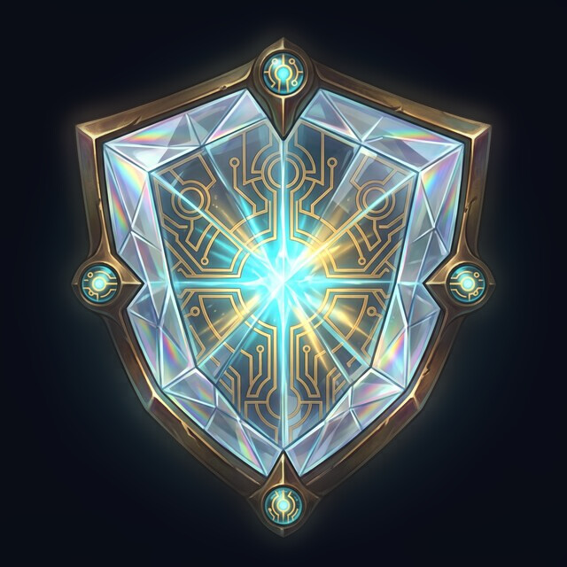

<table>
<tr>
<td></td>
<td>

# AEGIS

**A**utomated **E**TL **G**overnance & **I**nspection **S**ystem

</td>
</tr>
</table>

A read-only **control plane for heterogeneous job schedulers** — one pane of glass
over VisualCron, SQL Server Agent, and Apache Airflow (incl. AWS MWAA) for the
hybrid Windows/MSSQL/AWS shops that mainstream observability tooling ignores.

> *An aegis is the shield of Zeus and Athena — protection, held over everything
> that runs.*

## The 10,000-foot view

AEGIS is the shield over everything that runs. It tells you **what's scheduled,
what's failing, who owns it, and whether the data feeding it is any good** —
*before* the business finds out the hard way.

Your organization runs on hundreds or thousands of scheduled jobs across three
schedulers. Today that means three UIs, three alert systems, and no shared
picture: failures get noticed by customers instead of monitoring, bad data
propagates silently downstream, and developers burn 20–30% of their time
finding and diagnosing failures that are mostly missing files and schema drift,
not code bugs.

AEGIS fixes this with three capabilities:

- **Visibility** — one read-only inventory, timeline, and dependency graph over
  every scheduler, with ownership *harvested* from the job descriptions teams
  already write (so it can't rot).
- **Triage** — one alert per root cause, routed to the right owner, classified
  by a small known taxonomy instead of a firehose of forty emails.
- **Enforcement** — per-feed data contracts validated at the landing zone
  *before* any pipeline runs, so a bad file is quarantined with a precise,
  carrier-ready diff instead of poisoning downstream jobs.

What that means for the business: reclaimed engineering time, an audit trail
that generates itself (SOX evidence without the quarterly screenshot
archaeology), and customer-facing risk replaced by proactive detection — all at
zero license cost, riding the S3/SOX centralization you're already doing.

Just as important is what AEGIS is **not**: it is read-only and metadata-only.
It never schedules, triggers, or authors jobs, and file contents are inspected
in place — PHI/PII never enters the system. That posture is what makes it safe
to pilot and easy to sail through SOX change management.

## The problem

Shops that grew up on SQL Server and Windows and later adopted Airflow end up with
hundreds or thousands of scheduled jobs spread across three schedulers with three
UIs, three alerting systems, and no shared picture. The result is always the same:

- **Alert-fatigue firehose** — failure emails nobody reads; failures get noticed
  by downstream consumers instead of monitoring.
- **Silent stale-data propagation** — an upstream job fails, downstream jobs run
  business-as-usual on stale inputs and deliver them with a green checkmark.
- **Triage tax** — developers burn 20–30% of their time *finding and diagnosing*
  failures, most of which are data/file/schedule issues, not code bugs.
- **Documentation rot** — ownership scattered across wikis, tickets, and job
  descriptions in three different formats.

## The three pillars

1. **Control plane** — read-only collectors normalize jobs and run states from
   every scheduler into one inventory, one timeline, one dependency graph. The
   ownership catalog is **derived** by parsing the metadata teams already keep in
   job descriptions (tickets, teams, tags) — harvested, never hand-curated, so it
   can't rot.
2. **Signal layer** — fingerprint-based dedup and grouping, route-to-owner
   alerting, and a rule-based failure classifier (file missing/late, filemask
   drift, schema drift, data violation, upstream failure, schedule collision,
   connection, code bug).
3. **Contract layer** — per-feed data contracts (filemask, arrival SLA, schema,
   nullability) enforced by a landing-zone validator **before** any pipeline
   runs. S3-native and event-driven; proactive missing/late alerts; precise
   schema-drift diffs; quarantine.

## Design principles

- **Read-only. Not an orchestrator. Ever.**
- **Metadata-only, always** — file contents are inspected in place; only
  metadata (names, timestamps, schema diffs, counts) ever leaves. PHI/PII never
  enters the system.
- **Harvest, don't ask** — the catalog regenerates from sources on every sync.
- **Stable job identity** — canonical job IDs with per-scheduler source
  bindings; history survives migrations between schedulers.
- **Monitor the monitor** — collector heartbeats and visible data staleness.

## Architecture

AEGIS is a .NET 10/C# system in three layers, all read-only against the systems
it observes:

- **Collectors** — stateless `BackgroundService` workers (one per source
  system) that poll each scheduler on a 30–60s interval and normalize what they
  see into the store. SQL Agent is read from `msdb`; Airflow/MWAA from its REST
  API; VisualCron from its native .NET client API. Each collector emits
  heartbeats and records per-sync row counts, so a collector that dies — or one
  that is *alive but returning zero rows* — is itself a routed alert.
- **Store** — SQL Server, the home turf of the Windows/MSSQL shops this
  targets. Append-only run history plus current-state tables; contracts live in
  git as YAML and sync to the DB as versioned rows. Identity is ULID-based and
  explicit: a job migrating between schedulers is a deliberate, audited rebind,
  never an auto-merge.
- **API + UI** — a stateless ASP.NET Core minimal API, with a Blazor Server +
  SignalR dashboard on top for live green/red views. The API stays a separate
  layer from day one, so a Blazor WASM front end is an escape hatch, not a
  rewrite.

The contract layer is event-driven: S3 event notifications (SQS) trigger a
validation worker that inspects each arriving file in place against its
contract — metadata-only — and quarantines violations before any pipeline runs.

## Stack

ASP.NET Core minimal API · Blazor Server + SignalR (live dashboards) ·
SQL Server · .NET background-worker collectors · S3 events (SQS) / MinIO for dev.

## Running it locally

New here? Start with [docs/QUICKSTART.md](docs/QUICKSTART.md) — prerequisites,
step-by-step install, verification, and troubleshooting.

```sh
docker compose up -d                        # SQL Server (Agent on, sample jobs), MinIO, Airflow (sample DAGs)
dotnet run --project src/Aegis.Migrations   # creates the Aegis database and applies the DbUp scripts
dotnet run --project src/Aegis.Api          # hosts the collectors; Development settings point at the stack
dotnet run --project src/Aegis.Validator    # syncs contracts/ YAML into versioned ContractVersion rows
dotnet run --project src/Aegis.Generator    # drops a day of synthetic carrier feeds under generated_feeds/
dotnet test                                 # unit tests, plus Testcontainers round-trips (needs Docker)
```

The stack comes with something to observe: four SQL Agent jobs (one succeeds every
minute, one fails every minute with a missing vendor file, one two-step job fails on
its second step, and one purges history older than 20 minutes to simulate hostile
retention), and three Airflow DAGs (succeeding, failing, paused). Airflow is at
<http://localhost:8080> (`admin` / `admin`), MinIO at <http://localhost:9001>
(`aegis` / `aegis-dev-secret`). Every credential here is dev-stack only.

Collection is visible in the store as soon as the API is up:

```sql
SELECT Id, SourceSystemId, Status, JobCount, UnownedCount, ErrorText FROM dbo.CatalogSync ORDER BY Id DESC;
SELECT j.Name, r.Status, r.StartedAt, r.EndedAt, r.FingerprintId FROM dbo.JobRun r JOIN dbo.Job j ON j.Id = r.JobId ORDER BY r.StartedAt DESC;
```

Solution layout: `Aegis.Api` (minimal API; hosts the collectors for now),
`Aegis.Collectors` (SQL Agent and Airflow adapters over one shared persistence
cycle), `Aegis.Generator` (synthetic feeds with injected violations and a manifest
that says what was injected where), `Aegis.Migrations` (DbUp, plain SQL scripts),
`Aegis.Validator` (Track B: contract YAML parsing + git→DB sync; the landing-zone
validator engine is next), `Aegis.Web` (Blazor template, task 4.2),
and `tests/` (xUnit; the integration project runs against real containers).

## Status

**Design phase.** A design-review session (2026-09-02) produced
[docs/DESIGN-v2.md](docs/DESIGN-v2.md) — the working draft, which revises the
build sequencing to two parallel tracks over a shared substrate, adds the core
data model (with the three locked schema decisions), and specifies per-collector
integration spikes. The v1 record (2026-07-13) was folded into v2. A follow-up planning session
produced [docs/ROADMAP.md](docs/ROADMAP.md) — the start-to-finish work breakdown
(6 epics, ~43–56 evening-units, two parallel demo tracks). The stack is now argued and recorded in
[docs/TECH-STACK.md](docs/TECH-STACK.md) — .NET 10/C# throughout (Blazor
Server + SignalR UI, SQL Server, background-worker collectors), pure-.NET
validator behind an interface, hybrid EF Core/Dapper with DbUp migrations,
CSV/fixed-width feeds first with JSON fast-following. Getting up and running is
covered in [docs/QUICKSTART.md](docs/QUICKSTART.md).

**Implementation started (2026-09-02).** Task 1.1 (solution scaffold + CI +
dev stack) is done: the solution is scaffolded across Api/Web/Collectors/
Validator/Migrations plus unit and integration test projects, the DbUp
migration pipeline runs a baseline script, `docker-compose.yml` stands up the
dev stack (SQL Server Dev with Agent, MinIO, Airflow), and GitHub Actions CI
builds and tests on .NET 10. `dotnet build` and `dotnet test` are green
locally. Task 1.2 (core DDL) and 1.3 (monitor-the-monitor substrate) are done:
the full schema applies via DbUp, round-trip tests cover identity/bindings/
ownership/runs, and a stale-collector sweep raises `CollectorStale` when a
source's heartbeat goes quiet. Task 2.1 (contract spec + versioning) is done:
contracts are YAML, parsed and validated by `Aegis.Validator`, and synced to
the store with `SpecHash`-deduplicated versioning. Next on the critical path is
task 2.2 (arrival capture).
